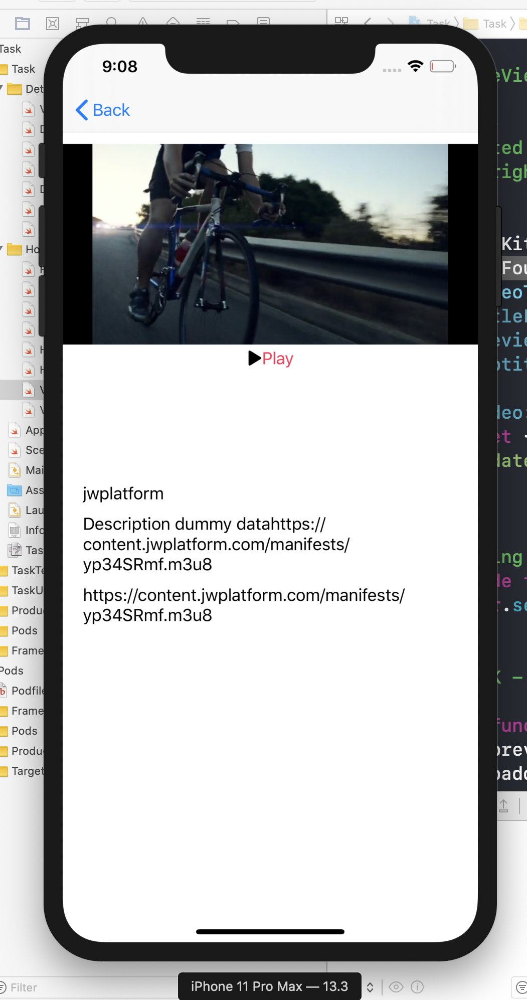

# Vedio Example of using AVFoundation
This project example for using AVKit framework and AVFoundation 
### Today Extension
|   Screen2  | 
|--------------|
||
# SetUp
xcode Version 11.3 (11C29)
swift 5 
pod install only on project folder
